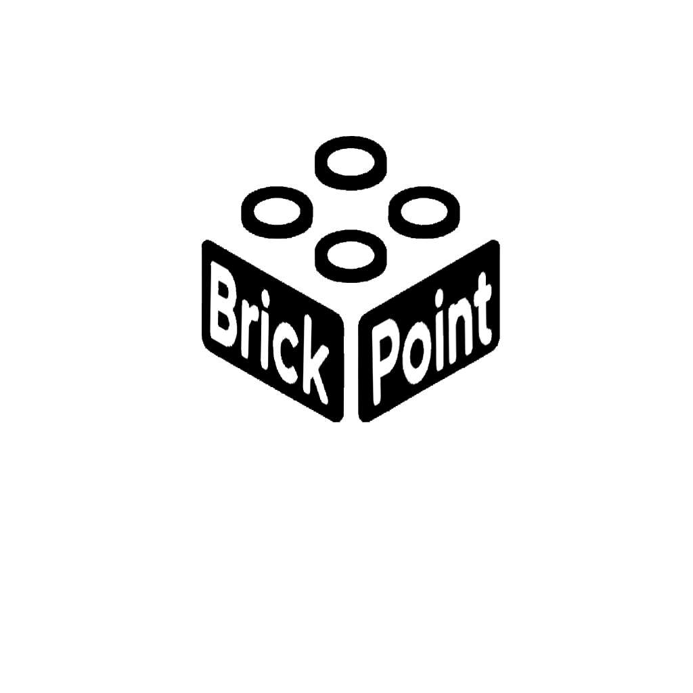

# Proyecto-Final-DAW

## BrickPoint / BrickHub

| Autor            | Alejandro Ríos Bermúdez                             |
| ---------------- | ----------------------------------------------------- |
| Centro Educativo | I.E.S. Francisco Romero Vargas (Jerez de la Frontera) |
| Grado Superior   | Desarrollo de Aplicaciones Web                        |
| Curso            | 2023/2024                                             |

## Índice

1. Introducción
2. Finalidad
3. Objetivos
4. Medios necesarios
5. Planificación

## Introducción

En el presente anteproyecto se desglosará paso a paso la temática del proyecto web que he decidido iniciar, llamado BrickPoint

BrickPoint se trata de una plataforma en la que los usuarios pueden adquirir piezas de LEGO en concreto, además de poder subir fotos de sus creaciones y tendrán adjuntas las instrucciones de montaje para aquellas personas interesadas en recrear la creación. En los siguientes apartados se explica en mayor detalle estas funciones.

## Finalidad

La finalidad de BrickPoint es crear una plataforma digital que sirva como un punto de encuentro para los entusiastas de LEGO, ofreciendo un espacio interactivo donde puedan adquirir piezas específicas facilmente, compartir sus creaciones y conectarse con otros apasionados por la marca. La plataforma aspira a fomentar la creatividad, la colaboración y el intercambio de ideas dentro de la comunidad.

## Objetivos

1. **Facilitar la Adquisición de Piezas:** Proporcionar a los usuarios la posibilidad de comprar piezas de LEGO específicas para sus construcciones.
2. **Fomentar la Creatividad:** Ofrecer un espacio donde los usuarios puedan compartir sus creaciones, ya sean gratuitas o a través de un modelo de pago, promoviendo la creatividad y la innovación.
3. **Construir una Comunidad Activa:** Establecer un foro dinámico para que los usuarios discutan, colaboren y participen en desafíos y concursos, fortaleciendo los lazos dentro de la comunidad.
4. **Integrar Eventos y Reuniones Locales:** Organizar eventos y encuentros locales para que los entusiastas de LEGO puedan interactuar en persona, construyendo una comunidad sólida.
5. **Ofrecer una Experiencia Adaptativa:** Garantizar que la plataforma sea fácilmente accesible, adaptable y reconocible en diferentes contextos y dispositivos.
=======
| Autor | ALejandro Ríos Bermúdez |
| ----- | ------------------------- |
| Tutor |                           |

| I.E.S. Francisco Romero Vargas (Jerez de la Frontera) |
| ----------------------------------------------------- |
| Desarrollo de Aplicaciones Web                        |
| Curso: 2023/2024                                      |

## Introducción:

El anteproyecto de BrickPoint tiene como objetivo la creación de un prototipo para una tienda online especializada en la venta de piezas LEGO. Además de la funcionalidad básica de compra, este prototipo incluirá una sección especial donde los usuarios podrán compartir sus creaciones junto con instrucciones detalladas para inspirar a la comunidad.

---

## Finalidad:

La finalidad de BrickPoint como prototipo se amplía para explorar la interacción comunitaria mediante la creación y compartición de proyectos. Además de evaluar la experiencia de compra básica, se busca fomentar la creatividad y la colaboración entre los aficionados a LEGO.

---

## Objetivos:

1. **Desarrollar un Prototipo de Plataforma de Compras Online:**
   * Crear un entorno web interactivo donde los usuarios puedan explorar productos y simular procesos de compra.
2. **Implementar un Sistema Básico de Carrito de Compras:**
   * Diseñar y ejecutar un sistema de carrito de compras simplificado para evaluar la experiencia de usuario.
3. **Gestión de Usuarios y Sesiones:**
   * Establecer un sistema de gestión de usuarios con funcionalidades básicas de registro, inicio de sesión y perfiles.
4. **Sección de Creaciones y Compartición:**
   * Introducir una sección donde los usuarios puedan subir imágenes de sus creaciones LEGO y proporcionar instrucciones detalladas.

---

## Medios Necesarios:

### Hardware

* **Ordenador personal**

### Software

* **Entorno de desarrollo:** Visual Studio Code
* **Frameworks** : Front-End: React, Back-End: aún en estudio, aunque probablemente Symfony
* **Elementos gráficos:** bibliotecas de imágenes gratuitas
* **Base de datos:** MySQL
* **Aspecto de la web:** Bootstrap y CSS personlizado
* API: base de datos de piezas de LEGO Brickable

---

**Planificación**

1. Acceso a la API de Brickable (1h) Obtención de token de acceso a la API
2. Comienzo del proyecto(5h)

   - Creación de la estructura básica del sitio
   - Conexion con la API
   - Mostrar datos de la API
3. Funcionalidades principales (20h)

   - Inicio de sesion y registro de usuarios
   - Perfil de usuarios
   - Creacion de pagina de inicio y estilos
   - Busqueda con filtro de las piezas de LEGO
   - Carrito de piezas
   - Apartado de administracion de la pagina
4. Funcionalidad foro(20h)

   - Creacion de publicacion con imagenes de la construccion junto con sus instrucciones
   - Apartado de feedback de la construccion (likes y comentarios)
   - Creaciones mas votadas
   - Pago o descarga de instrucciones
5. Retoques del apartado visual y búsqueda de errores (4h)
6. Pruebas finales (4h)

Tiempo total estimado: 54 horas
>>>>>>> 90a6120745390bbd4e20ad852e025695d1d87484
